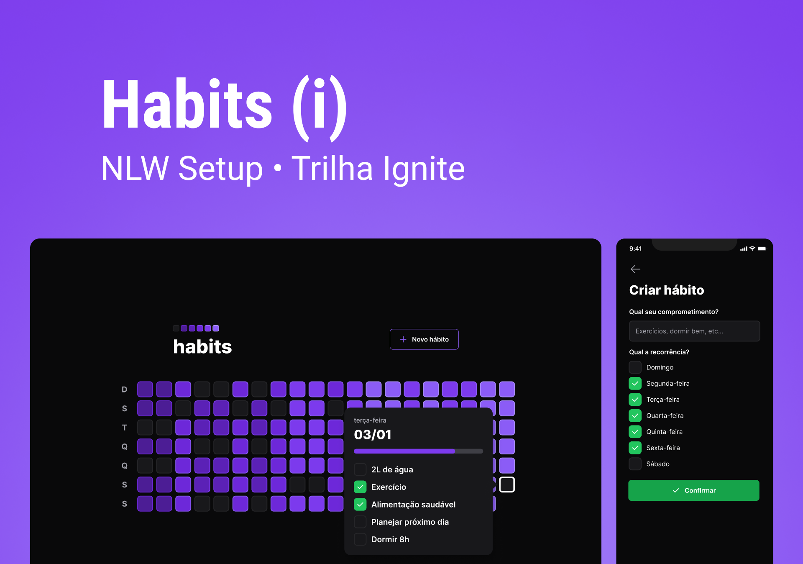
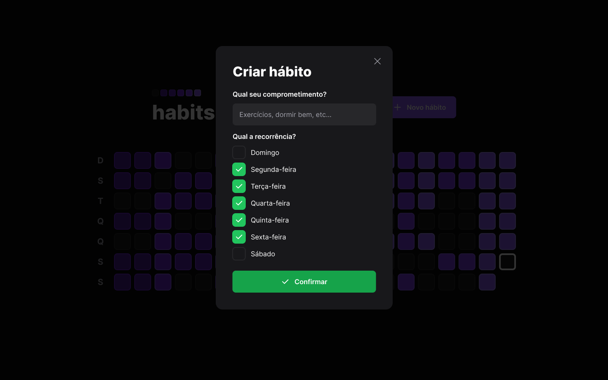
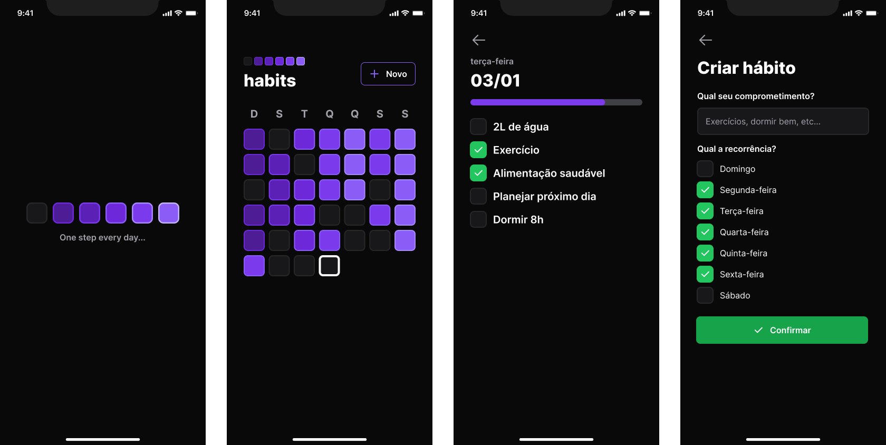

<div align="center" id="top">
  

  &#xa0;

  <!-- <a href="https://nlw-11-habits.netlify.app">Demo</a> -->
</div>

<h1 align="center">Nlw 11 Habits</h1>

<p align="center">
  

  

  

  

<hr>

<p align="center">
  <a href="#dart-about">About</a> &#xa0; | &#xa0;
  <a href="#sparkles-features">Features</a> &#xa0; | &#xa0;
  <a href="#rocket-technologies">Technologies</a> &#xa0; | &#xa0;
  <a href="#white_check_mark-requirements">Requirements</a> &#xa0; | &#xa0;
  <a href="#checkered_flag-starting">Starting</a> &#xa0; | &#xa0;
  <a href="#memo-license">License</a> &#xa0; | &#xa0;
  <a href="https://github.com/andrelinos" target="_blank">Author</a>
</p>

<br>

## :dart: About ##

Project developed at the NWL event by [Rocketseat Education](https://github.com/rocketseat-education) in 01/2023. This project is to control the user's day-to-day habits in favor of a healthier life or even to control important day-to-day tasks, such as calling a loved one.

## :sparkles: Features ##

- [x] Create habit
- [x] List habits
- [x] Check/UnCheck habits same done
- [x] Progressbar for habits
- [ ] Edit habit
- [ ] Delete habit
- [ ] Report habits
- [ ] List habits by category
- [ ] List habits by period
- [ ] Alert user about habit from day
- [ ] more...

## :rocket: Technologies ##

The following tools were used in this project:

- [Node.js](https://nodejs.org/en/)
- [React](https://pt-br.reactjs.org/)
- [React Native](https://reactnative.dev/)
- [Expo](https://expo.io/)
- [TypeScript](https://www.typescriptlang.org/)

## :white_check_mark: Requirements ##

Before starting :checkered_flag:, you need to have installed.

- [Git](https://git-scm.com)
- [Node](https://nodejs.org/en/)

### Recommended ###

- [Android Studio](https://developer.android.com/studio)
- [JDK 11](https://www.oracle.com/java/technologies/javase/jdk11-archive-downloads.html)

## :checkered_flag: Starting ##

```bash
# Clone this project
$ git clone https://github.com/andrelinos/nlw-11-habits

# Access api folder
$ cd nlw/api

# Install dependencies
$ npm i

# Access web folder
$ cd nlw/web

# Install dependencies
$ npm i

# Access mobile folder
$ cd nlw/mobile

# Install dependencies
$ npm i

# To run the project, you need to follow the run commands below:

# Access the api folder and run the command below, and the same for the web folder as well.
$ npm run dev 

# To mobile, execute command below:
$ npm expo start --clear

# The server will initialize in the <http://localhost:3333>
# The web will initialize in the <http://localhost:3000>

```

## Project folders ##

<div align="center" id="api">

## Project API

[](/api)

</div>

<div align="center" id="web">

## Project WEB

[](/web)

</div>

<div align="center" id="mobile">

## Project MOBILE

[](/mobile)

</div>

<div align="center" id="video">

## Video project running

[](https://www.youtube.com/watch?v=RPk0yheEjOk)

</div>

## :memo: License ##

This project is under license from MIT. For more details, see the [LICENSE](LICENSE.md) file.

Made with :heart: by <a href="https://github.com/andrelinos" target="_blank">Andrelino Silva</a>

&#xa0;

<a href="#top">Back to top</a>
